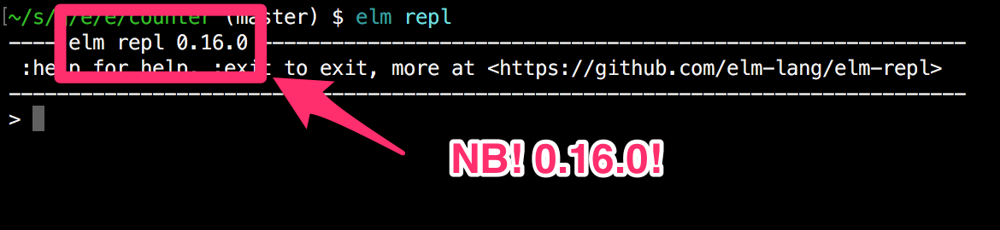
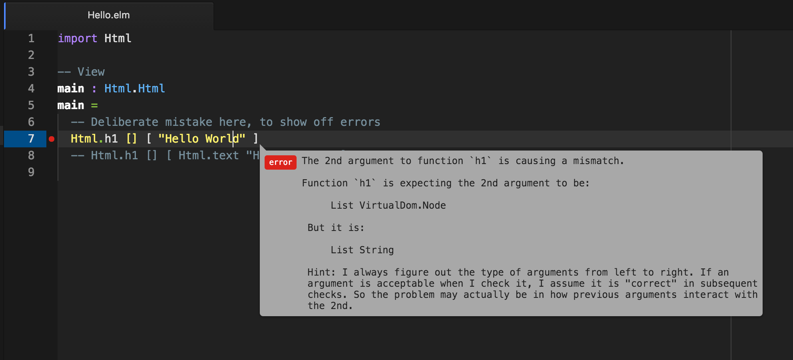
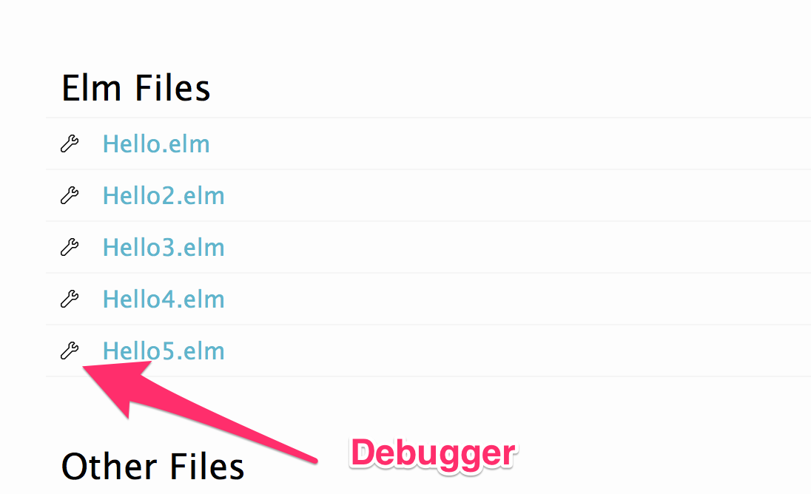
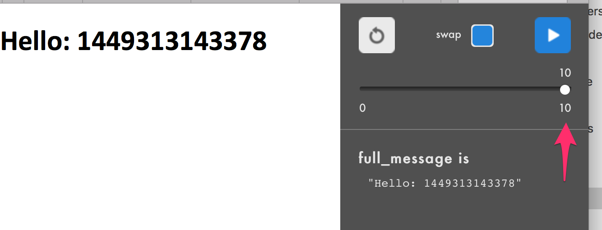

# Introduction to Elm 0.16

## Michael Twomey
## December 8th

---

# Goal

## Get you set up and up to the start of the Elm Architecture Tutorial

https://github.com/evancz/elm-architecture-tutorial

^ Why? Getting off the ground is hard, there's no Hello World in that tutorial!
^ This tutorial will ease you into the Elm Architecture Tutorial, at the end you should know enough to follow the Elm Architecture.

---

# [fit] Why Elm?

## [fit] Frontend
## [fit] Functional
## [fit] Fun!

(Not Javascript!)

^ Aimed squarely at frontend web development (HTML, Canvas and WebGL)
^ React js is borrowing ideas from Elm
^ Gateway language to functional programming
^ Fun! First language I'm really excited about since I discovered Python
^ Not Javascript!

---

# Setting Up

## (The boring bit)

---

# [fit] Install Elm

# [fit] http://elm-lang.org/install

^ Make we are using latest 0.16.0, if you downloaded 0.16.0 when it was released it might need to be downloaded again (there was a build problem).

---

# [fit] Install Atom

# [fit] https://atom.io

---

# Install Plugins

(Remember to 🙋 for help!)

- language-elm
- linter-elm-make

---

# Configure Plugins

- ```linter-elm-make``` might need help to find elm-make.
    - ```/usr/local/bin/elm-make```
- Indentation: Elm style guide recommends 2 or 4, pick one and stick with it 😀
    + (I use 2 spaces)

---

# Elm Repl

```haskell
$ elm repl
---- elm repl 0.16.0-----------------------------------------------------------
 :help for help, :exit to exit, more at <https://github.com/elm-lang/elm-repl>
-------------------------------------------------------------------------------
> 

```

---



^ Since the language is new and changing, it's quite important we all have the same (latest) version.
^ Bonus: the original 0.16.0 release had two bugs I know of, one cosmetic which affected the atom plugin error message formatting and one more serious which broke the debugger.

---

```haskell
$ elm repl
---- elm repl 0.16.0 -----------------------------------------------------------
 :help for help, :exit to exit, more at <https://github.com/elm-lang/elm-repl>
--------------------------------------------------------------------------------
> 1 + 1
2 : number
> "Hello there"
"Hello there" : String
> [1, 2, 3]
[1,2,3] : List number
> {x = 1, y = 2}
{ x = 1, y = 2 } : { x : number, y : number' }
```

^ I don't actually use the REPL a huge amount, I find the compiler generally more helpful

--- 

# Hello World

```sh
mkdir hello
cd hello
atom .
elm package install evancz/elm-html
touch Hello.elm
elm reactor
```

If you go to http://localhost:8000 and click on Hello.elm you'll get a compiler error. This is good.

^ Note for Atom users: the atom Elm plugin gets confused by nested directories, e.g. if you checkout the examples and edit them the linting won't work, but if you open the folder directly it will work (e.g. atom examples vs atom examples/1).

---

# Hello.elm

```haskell
import Html

-- View
main : Html.Html
main =
  -- Deliberate mistake here, to show off errors
  Html.h1 [] [ "Hello World" ]
  -- Html.h1 [] [ Html.text "Hello World" ]
```

^ Deliberate mistake here

---



---

```haskell
import Html

-- View
main : Html.Html
main =
    Html.h1 [] [ Html.text "Hello World" ]
```

http://localhost:8000/Hello.elm

^ Now we have a working program
^ Note the -- View
^ Namespaces
^ Contracts (type declaration), try commenting it out

---

# Slightly less typing

```haskell
import Html exposing (..)

-- View
main : Html
main =
    h1 [] [ text "Hello World" ]
```

^ Change is the exposing (..)
^ import X as Y exposing (Z)
^ Found Elm quite smart about names, you can have a Message module and a Message type

---

# Functions

```haskell
import Html exposing (..)

-- View
view : String -> Html
view message =
  h1 [] [ text message ]

main : Html
main =
  view "Hello World!"
```

^ While typing try saving, you should see errors when you change the function signature


---

```haskell
import Html exposing (..)
import Time

-- View

view : Float -> String -> Html
view time message =
  h1 [] [ text (message ++ toString time) ]

main : Signal Html
main =
  Signal.map2 view (Time.every Time.second) (Signal.constant "Hello: ")
```

^ Getting more exciting, using Elm Signals

---

# TODO Signals

---

```haskell
import Html exposing (..)
import Time

-- View

view : Float -> String -> Html
view time message =
  let
    full_message = message ++ toString time
  in
    h1 [] [ text full_message ]

main : Signal Html
main =
  Signal.map2 view (Time.every Time.second) (Signal.constant "Hello: ")
```

^ Now using let expressions, makes code much more readable

---

```haskell
import Debug
import Html exposing (..)
import Time

-- View

view : Float -> String -> Html
view time message =
  let
    full_message = message ++ toString time
    _ = Debug.watch "full_message is" full_message
  in
    h1 [] [ text full_message ]

main : Signal Html
main =
  Signal.map2 view (Time.every Time.second) (Signal.constant "Hello: ")
```

^ Using let to add a debug watch

---



---



---

# Covered so far

- Elm Reactor
- Importing
- Basic functions
- Function Signatures
- Signals
- Let Expressions
- Debugger
- "Views"

---

# Bonus: Prettier dates

```sh
elm package install mgold/elm-date-format
```

---

```haskell
import Date
import Date.Format exposing (format)
import Debug
import Html exposing (..)
import Time

-- View

view : Float -> String -> Html
view time message =
  let
    _ = Debug.watch "raw time is" time
    full_message = message ++ format "%A %H:%m:%S" (Date.fromTime time)
    _ = Debug.watch "full_message is" full_message
  in
    h1 [] [ text full_message ]

main : Signal Html
main =
  Signal.map2 view (Time.every Time.second) (Signal.constant "Hello: ")
```

---

# Counter

First part of the Elm Architecture Tutorial covers counters, so we're gonna create one. Getting there...

```sh
cd ..
mkdir counter
cd counter
elm package install evancz/elm-html 
elm package install evancz/start-app
atom .
touch Counter.elm Main.elm
elm reactor
```

---

# Counter.elm

```haskell
module Counter where

-- Model

type alias Model = Int
```

^ Ooh, a Model
^ Simplest possible model, a number
^ Declaring a module (for re-using)

---

```haskell
module Counter where
import Html exposing (..)
import Html.Attributes exposing (style)

-- Model
type alias Model = Int

-- Views
view : Model -> Html
view model =
  div []
    [ button [] [ text "-" ]
    , div [ style [("font-size", "20px")] ] [ text (toString model) ]
    , button [] [ text "+" ]
    ]

main : Html
main =
  view 0
```

^ A model and a view, we pass the model in and get Html back
^ Most basic part of Elm's patterns

---

```haskell
-- View
countStyle : Attribute
countStyle =
  style
    [ ("font-size", "20px")
    , ("font-family", "monospace")
    , ("display", "inline-block")
    , ("width", "50px")
    , ("text-align", "center")
    ]

view : Model -> Html
view model =
  div []
    [ button [] [ text "-" ]
    , div [ countStyle ] [ text (toString model) ]
    , button [] [ text "+" ]
    ]
```

^ Adding a countStyle function, looks nicer and closer to Elm tutorial

---

# Main.elm

```haskell
import Counter exposing (update, view)

import Html exposing (Html)
import StartApp.Simple exposing (start)


main : Signal Html
main =
  start
    { model = 0
    , update = update
    , view = view
    }
```

^ This pattern is baked into a package called startapp
^ Model / Update / View pattern
^ Core Elm pattern
^ You'll get an error, we haven't implemented update yet

---

```haskell
...
-- Model
type alias Model = Int

-- Update
type Action =
  Increment
  | Decrement

update : Action -> Model -> Model
update action model =
  0

-- View
...
-- Delete main : Html at end of file
```

^ Now Main should work (still doesn't do anything :))

---

```haskell
...
import Html.Attributes exposing (style)
import Html.Events exposing (onClick)
...
update : Action -> Model -> Model
update action model =
  case action of
    Increment ->
      model + 1
    Decrement ->
      model - 1
...
view : Signal.Address Action -> Model -> Html
view address model =
  div []
    [ button [ onClick address Decrement ] [ text "-" ]
    , div [ countStyle ] [ text (toString model) ]
    , button [ onClick address Increment ] [ text "+" ]
    ]
```

---

# Woo, a Counter!

---

# Elm Learning

- http://elm-lang.org/docs
- https://github.com/evancz/elm-architecture-tutorial/
- http://package.elm-lang.org
- https://pragmaticstudio.com/elm
- https://pragmaticstudio.com/elm-signals
